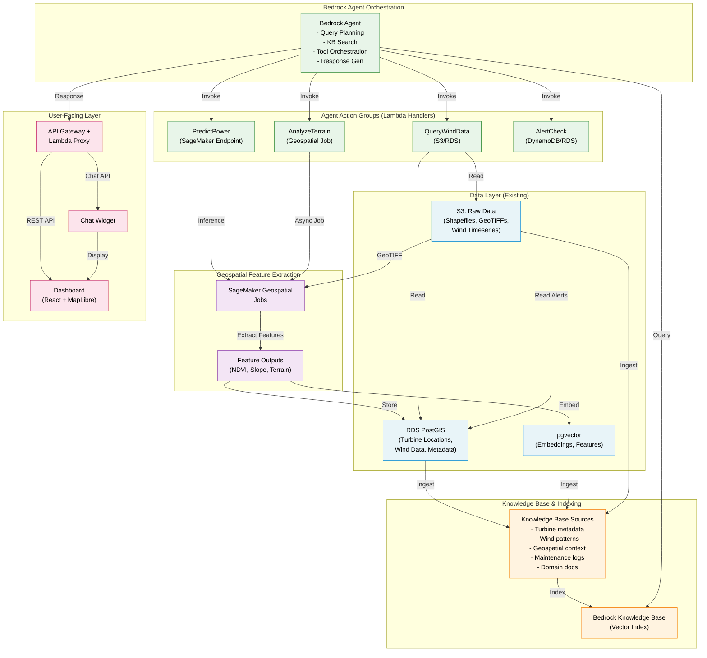

# GenAI Architecture: Wind Farm Intelligence Platform

## Overview
This document describes the end-to-end GenAI architecture integrating SageMaker Geospatial, Bedrock Agents, and wind farm data layers to provide intelligent, context-aware insights via natural language.

---

## Architecture Diagram

---

## Component Descriptions

### Data Layer
- **S3 Raw Data**: Shapefiles (turbine locations), GeoTIFFs (terrain/elevation/satellite), wind timeseries (CSV/Parquet).
- **RDS PostGIS**: Relational store for turbine metadata, wind measurements, predictions, alerts, maintenance schedules.
- **pgvector**: Vector embeddings for similarity search; stores feature vectors from geospatial analysis and ML embeddings.

### Geospatial Feature Extraction
- **SageMaker Geospatial**: Processes GeoTIFFs to compute:
  - NDVI (vegetation index)
  - Slope, aspect, terrain ruggedness
  - Land cover classification
  - Hillshade, flow accumulation
  - Change detection (seasonal/annual)
- Outputs stored as rasters in PostGIS or as feature vectors in pgvector.

### Knowledge Base & Indexing
- **Sources**:
  - Turbine metadata (ID, location, power curve, installation date)
  - Wind patterns (seasonal, diurnal, extreme events)
  - Geospatial context (terrain, obstacles, land use)
  - Maintenance schedules and maintenance logs
  - Domain knowledge docs (IEC 61400, wind farm best practices)
- **Bedrock Knowledge Base**:
  - Automatically vectorizes documents using Bedrock's embedding model (default or custom).
  - Enables semantic search (RAG retrieval).
  - Supports chunking strategies for large documents.

### Bedrock Agent Orchestration
- **Agent Role**:
  - Receives natural language query from user.
  - Searches Knowledge Base for relevant context.
  - Plans and executes multi-step workflows.
  - Invokes Lambda action handlers.
  - Generates natural language response.
- **Prompt Engineering**:
  - System prompt defines agent persona and reasoning approach.
  - Instruction groups guide which actions to take for different query types.
  - Examples of successful reasoning provided in few-shot prompts.

### Action Groups (Lambda Handlers)
1. **QueryWindData**: Query RDS for turbine data, wind measurements, historical patterns.
2. **PredictPower**: Invoke SageMaker Endpoint to run ML model for power predictions.
3. **AnalyzeTerrain**: Trigger SageMaker Geospatial job for feature analysis; query PostGIS.
4. **AlertCheck**: Retrieve maintenance alerts, operational status from RDS/DynamoDB.

### User-Facing Layer
- **API Gateway + Lambda Proxy**: Exposes Bedrock Agent as REST API.
- **Dashboard**: React + MapLibre for interactive map visualization.
- **Chat Widget**: Conversational interface for natural language queries.

---

## Data Flow (Example Query)

**User Query**: *"What's the predicted wind power for turbines on steep terrain in the northern zone next week?"*

1. **Chat Widget** sends query to API Gateway.
2. **Lambda Proxy** invokes Bedrock Agent with query.
3. **Agent** searches Knowledge Base:
   - Retrieves: "Northern zone turbine IDs", "Terrain features", "Historical wind patterns".
4. **Agent** identifies needed actions:
   - `QueryWindData` (get turbine locations, wind forecast).
   - `AnalyzeTerrain` (get slope data for northern turbines).
   - `PredictPower` (invoke ML model with forecast + terrain features).
5. **Action Handlers** execute:
   - Lambda 1: Queries RDS → returns turbine list + location in northern zone.
   - Lambda 2: Queries PostGIS spatial index (slope > threshold) → filters steep terrain turbines.
   - Lambda 3: Calls SageMaker Endpoint with weather forecast + terrain data → returns predictions.
6. **Agent** compiles results, reasoning, and confidence.
7. **Response** returned to Dashboard:
   - Natural language summary.
   - List of predicted turbines with power values.
   - Map overlay showing terrain slope + predicted power heatmap.

---

## Key Design Decisions

| Aspect | Choice | Rationale |
|--------|--------|-----------|
| **LLM Foundation** | Claude 3 (Bedrock) | Strong reasoning, multimodal capable, cost-efficient, built-in safeguards. |
| **Orchestration** | Bedrock Agents | Native tool invocation, multi-step reasoning, prompt management. Avoids self-hosted LLM/orchestration overhead. |
| **Knowledge Base** | Bedrock KB | Built-in RAG, auto-vectorization, no vector DB ops. Integrated with Bedrock Agents. |
| **Geospatial Processing** | SageMaker Geospatial | Purpose-built for raster/vector analysis. Native PostGIS integration. Async jobs acceptable for batch feature extraction. |
| **Spatial Queries** | PostGIS + pgvector | Leverages existing RDS; GIST indexes for spatial ops; pgvector for feature similarity. No separate vector DB needed for MVP. |
| **Inference** | SageMaker Endpoint | Low-latency online predictions. Can use serverless for variable load. |
| **Frontend** | React + MapLibre | Industry-standard geospatial UI; MapLibre is open-source, cost-free rendering. |
| **Auth** | Cognito | Managed user pools, MFA, federated login; integrates with API Gateway. |

---

## Scalability Considerations

- **High Query Volume** (>100/day): Use SageMaker Endpoint Autoscaling or serverless; cache frequent KB searches in ElastiCache.
- **Large Dataset** (TB+ geospatial): Partition PostGIS tables by region/time. Use S3 Select for raw data filtering.
- **Concurrent Geospatial Jobs**: Queue SageMaker jobs in SQS; use Step Functions for job orchestration.
- **Knowledge Base Size** (100k+ documents): Use Bedrock KB chunking; implement document retention policies.

---

## Backup & Disaster Recovery

- **KB Data**: Stored in S3 (backed by Bedrock). Enable S3 versioning and cross-region replication.
- **PostGIS**: Automated RDS snapshots (daily), cross-region backup.
- **SageMaker Models**: Version in S3; model registry with approval workflow.
- **Agent Definition**: Version control (Terraform/IaC); stored in Git.

---

## Next Steps

1. Ingest Knowledge Base sources into S3.
2. Create Bedrock Knowledge Base (Terraform + manual indexing).
3. Define Bedrock Agent + action groups.
4. Implement Lambda handlers for each action.
5. Test agent workflows (end-to-end).
6. Deploy API Gateway + dashboard.
7. Validate responses against ground truth; collect feedback.
